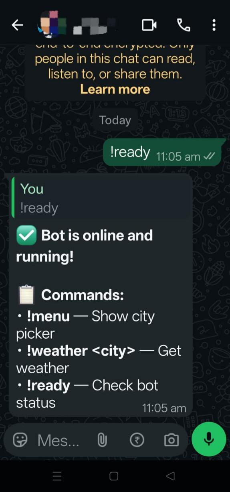
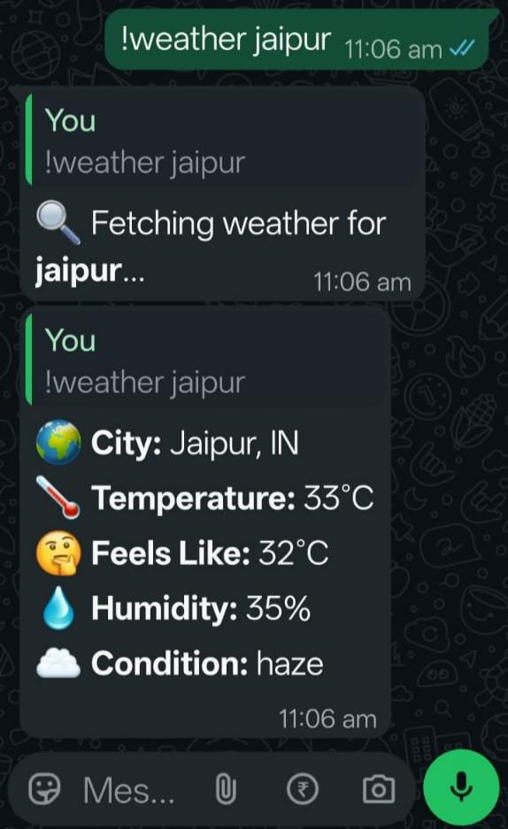
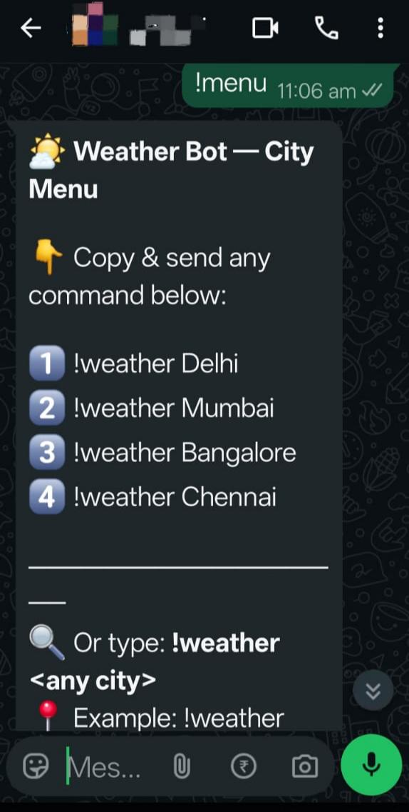

# 🌦️ WhatsApp Weather Bot

A simple and beginner-friendly WhatsApp chatbot built using Node.js that provides **real-time weather information** directly inside WhatsApp chats.

Built with:

* Node.js
* whatsapp-web.js
* OpenWeatherMap API
* Puppeteer
* Axios

---

## 🚀 Features

✅ Get live weather for any city
✅ WhatsApp command-based bot
✅ QR code login system
✅ Error handling for invalid cities
✅ Simple single-file architecture (`index.js`)
✅ Beginner-friendly project structure
✅ Real-time API integration
✅ Persistent login using LocalAuth

---

# 📸 Bot Screenshots

## 🔹 Bot Online Check

---

## 🔹 Weather Command Example

---

## 🔹 Menu Command

---

## 💬 Example Usage

User sends:

```bash
!weather Delhi
```

Bot replies:

```bash
🌍 City: Delhi, IN
🌡 Temperature: 31°C
🤔 Feels Like: 32°C
💧 Humidity: 45%
☁ Condition: haze
```

---

# ⚙️ Installation & Setup

## 1️⃣ Clone Repository

```bash
git clone https://github.com/naman0549/weather-bot-.git
cd weather-bot-
```

---

## 2️⃣ Install Dependencies

```bash
npm install
```

---

## 3️⃣ Install Required Packages

```bash
npm install whatsapp-web.js qrcode-terminal axios
```

---

# 🔑 Setup OpenWeatherMap API

Get a free API key from:

[OpenWeatherMap API](https://openweathermap.org/api?utm_source=chatgpt.com)

Then replace this line inside `index.js`:

```js
const OPENWEATHER_API_KEY = "YOUR_OPENWEATHERMAP_API_KEY";
```

with your actual API key.

---

# ▶️ How To Run The Bot

## Step 1 — Start the bot

```bash
node index.js
```

---

## Step 2 — Scan QR Code

A QR code will appear in the terminal.

Open WhatsApp on your phone:

* Settings
* Linked Devices
* Link a Device

Now scan the QR code.

---

## Step 3 — Test Commands

Send these commands in any WhatsApp chat:

```bash
!ready
```

```bash
!menu
```

```bash
!weather Mumbai
```

---

# 💬 Available Commands

| Command           | Description              |
| ----------------- | ------------------------ |
| `!weather <city>` | Get live weather details |
| `!menu`           | Show available commands  |
| `!ready`          | Check bot status         |

---

# 🧠 Technologies Used

* JavaScript
* Node.js
* whatsapp-web.js
* Puppeteer
* Axios
* OpenWeatherMap API

---

# 🛠️ Future Improvements

* 5-day weather forecast
* GPS weather support
* Cloud deployment (Railway/Render)
* Multi-language support
* Wind speed & UV index
* Better UI formatting

---

# 📌 Limitations

* Requires linked WhatsApp device
* Host PC/server must stay online
* Free API has request limits
* Session may expire occasionally

---

# 📖 Learning Concepts

This project demonstrates:

* REST API integration
* Async/Await
* Event-driven programming
* WhatsApp automation
* Error handling
* Node.js fundamentals

---

# 🔗 GitHub Repository

[GitHub Repository](https://github.com/naman0549/weather-bot-?utm_source=chatgpt.com)

---

# ⭐ Author

Made by **Naman** (`naman0549`)

If you like this project, consider giving it a ⭐ on GitHub.
